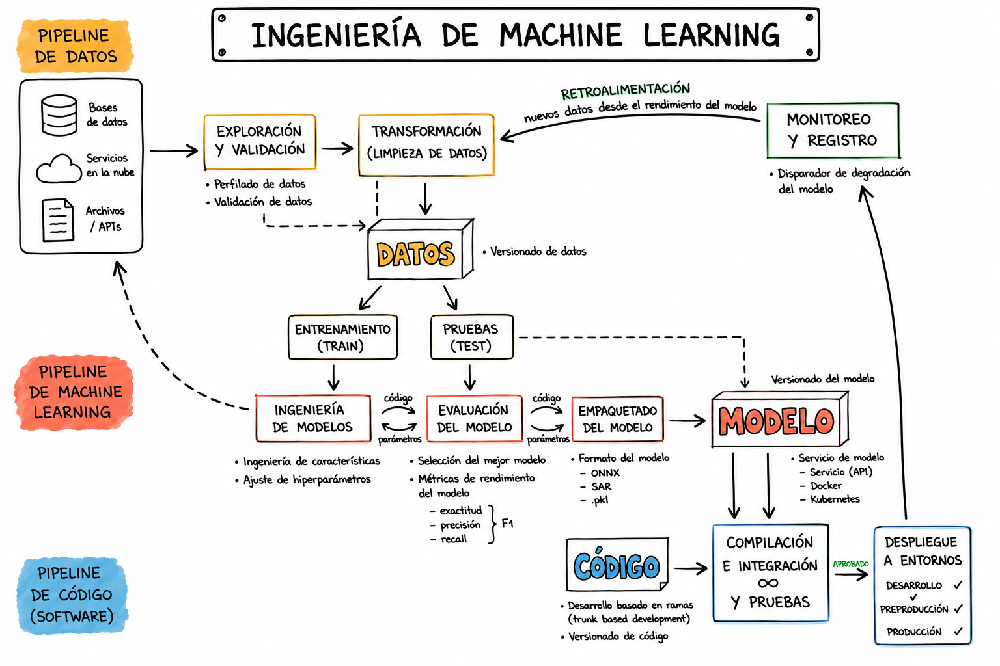

# 01. End-to-End ML Workflow Lifecycle 🔁

## 🖼️ Diagrama del ciclo

**Figura 1. Ciclo End-to-End de Machine Learning. Fuente: ml-ops.org, traducido a español por Carolina Mantilla.**

## 📌 Idea principal

Un proyecto de Machine Learning no solo consiste en entrenar un modelo.
Según la lectura, todo software basado en ML tiene **tres artefactos principales**:

* **Datos**
* **Modelo de ML**
* **Código**

A partir de eso, el ciclo se divide en tres grandes fases:

1. **Data Engineering**
2. **Model Engineering**
3. **Model Deployment / Code Engineering**

## 1. Data Engineering 🧹

Es la fase donde se adquieren, preparan y organizan los datos antes de entrenar el modelo.

Incluye:

* **Data Ingestion:** recolección de datos desde diferentes fuentes.
* **Exploration and Validation:** análisis de la estructura y calidad de los datos.
* **Data Wrangling:** limpieza, corrección y transformación de datos.
* **Data Labeling:** asignación de etiquetas a los datos.
* **Data Splitting:** división en datos de entrenamiento, validación y prueba.

Esta fase es crítica porque si los datos tienen errores, esos errores pueden afectar el modelo y generar resultados incorrectos.

## 2. Model Engineering 🧠

Es la fase donde se construye el modelo de Machine Learning.

Incluye:

* **Model Training:** entrenamiento del modelo con datos.
* **Feature Engineering:** selección o creación de variables útiles.
* **Hyperparameter Tuning:** ajuste de parámetros para mejorar el modelo.
* **Model Evaluation:** validación del desempeño del modelo.
* **Model Testing:** prueba final con datos separados.
* **Model Packaging:** exportar el modelo en un formato que pueda ser usado por una aplicación.

## 3. Model Deployment 🚀

Después de entrenar el modelo, este debe integrarse en una aplicación real.

Incluye:

* **Model Serving:** poner el modelo disponible en producción.
* **Model Performance Monitoring:** monitorear el comportamiento del modelo con datos nuevos.
* **Model Performance Logging:** registrar cada predicción o solicitud hecha al modelo.

## ⚠️ Punto clave

El ciclo de ML no termina cuando el modelo se entrena.
Después del despliegue, el modelo debe ser monitoreado porque los datos pueden cambiar y su rendimiento puede disminuir.

## 🔗 Relación con MLflow

MLflow se conecta con este ciclo porque permite:

* registrar experimentos
* guardar métricas
* comparar modelos
* versionar modelos
* apoyar el despliegue

Por eso, MLflow es una herramienta útil dentro de una estrategia MLOps.

## ✅ Conclusión

El ciclo End-to-End de ML muestra que un modelo necesita mucho más que entrenamiento.
Para que funcione en producción, se deben gestionar correctamente los datos, el modelo, el código, el despliegue y el monitoreo continuo.
