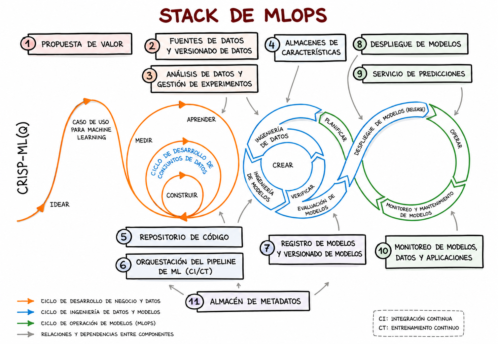
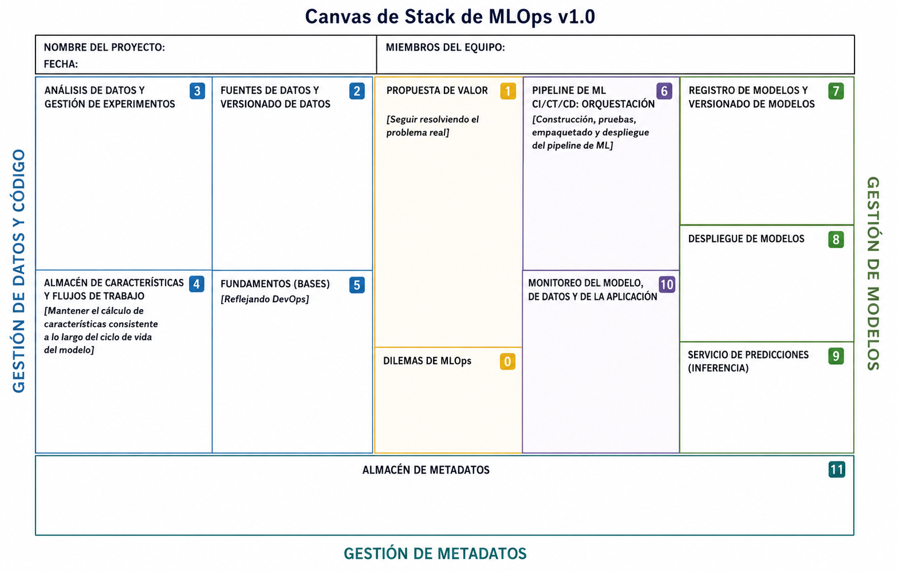
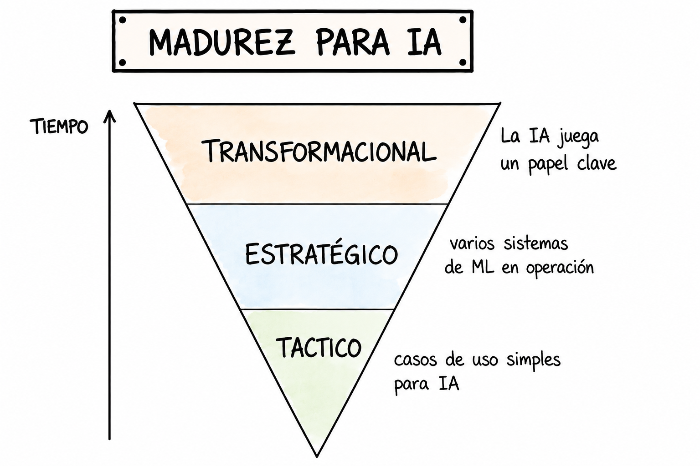

# 02. MLOps Stack Canvas 🏗️

## 📌 ¿Qué problema busca resolver?

Uno de los mayores desafíos en Machine Learning es llevar los modelos a producción.

Según la lectura, muchas organizaciones tienen dificultades para integrar herramientas, frameworks y plataformas de ML. El problema no suele ser entrenar el modelo, sino construir toda la infraestructura necesaria para operarlo, monitorearlo y mantenerlo.

## 🎯 ¿Qué es el MLOps Stack Canvas?

El **MLOps Stack Canvas** es un marco de trabajo que ayuda a diseñar la arquitectura completa de un sistema de Machine Learning.

Su objetivo es reunir en una sola vista:

* procesos
* herramientas
* infraestructura
* monitoreo
* gobierno del modelo

## 🧩 Vista general del Stack

**Figura 1. Stack de MLOps. Fuente: ml-ops.org, traducido a español por Carolina Mantilla.**

## 🏛️ Áreas principales

El Stack Canvas se organiza principalmente alrededor de tres áreas:

### 1. Gestión de Datos y Código 📂

Incluye:

* fuentes de datos
* versionado de datos
* análisis de datos
* experimentación
* feature store
* repositorio de código

### 2. Gestión de Modelos 🧠

Incluye:

* registro de modelos
* versionado de modelos
* despliegue
* serving de predicciones
* monitoreo del modelo

### 3. Gestión de Metadatos 📊

Incluye información sobre:

* datasets utilizados
* hiperparámetros
* métricas
* experimentos
* versiones de modelos
* ejecuciones del pipeline

## 📝 Canvas de trabajo

**Figura 2. Canvas de Stack de MLOps v1.0. Fuente: ml-ops.org, traducido a español por Carolina Mantilla.**

## 🔄 Automatización

El Canvas incorpora prácticas como:

* **CI:** integración continua
* **CT:** entrenamiento continuo
* **CD:** despliegue continuo

Esto permite automatizar el ciclo de vida del modelo, desde el entrenamiento hasta el despliegue y monitoreo.

## 📈 Niveles de madurez en IA

La lectura también relaciona MLOps con el nivel de madurez de una organización frente a la IA.

**Figura 3. Niveles de madurez para IA. Fuente: ml-ops.org, traducido a español por Carolina Mantilla.**

### Tactical 🚶

* casos de uso simples
* procesos manuales
* proyectos piloto

### Strategic 🏃

* varios sistemas de ML en operación
* uso de pipelines
* monitoreo básico

### Transformational 🚀

* la IA tiene un rol clave en el negocio
* automatización avanzada
* monitoreo continuo
* reentrenamiento automático

## 🔗 Relación con MLflow

MLflow encaja principalmente en:

* gestión de experimentos
* registro de modelos
* versionado de modelos
* seguimiento de métricas

Por eso, MLflow puede verse como una herramienta dentro del ecosistema de MLOps.

## ✅ Conclusión

El MLOps Stack Canvas permite visualizar todos los componentes necesarios para construir, desplegar y mantener soluciones de Machine Learning. Su propósito es ayudar a las organizaciones a identificar procesos, herramientas e infraestructura antes de llevar modelos a producción.

